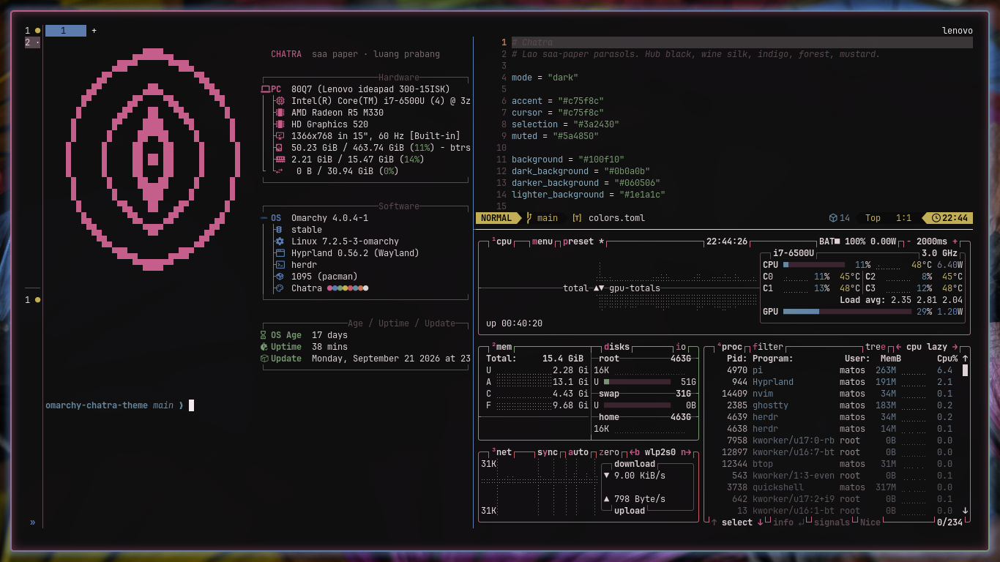

# Chatra

A dark [Omarchy](https://omarchy.org/) theme pulled from a close-up of **Lao saa-paper parasols** — the handmade umbrellas of Luang Prabang, still used to shade the sangha on procession days.

In Theravāda Buddhism the ceremonial umbrella is the **chatra**: protection, rank, and a moving temple roof. This palette is the stall at night — hub black, wine silk, indigo, forest, a little mustard left in the corner.



Live Omarchy 4 session: ceremonial parasol mark, the palette file in Neovim, btop in wine/indigo/forest. Wallpaper photograph by Fabio Matos.

## Install

```sh
omarchy theme install https://github.com/Matos182/omarchy-chatra-theme
```

Or *Install > Style > Theme* in the Omarchy menu (`Super + Space`) and paste that URL.

Omarchy generates terminals, Neovim, Hyprland borders, and the rest from `colors.toml` when the theme is applied.

## Palette

| Role | Hex | Source |
|------|-----|--------|
| Void | `#100f10` | Gaps between ribs, the hub |
| Wine | `#c75f8c` | Centre parasol |
| Indigo | `#5c7eb0` | Left parasol |
| Forest | `#7a9a72` | Right parasol |
| Mustard | `#c4b056` | Lower-left paper |
| Paper | `#e0d4d8` | Dusty lilac grain |
| Maroon | `#c45a64` | Folded silk in shadow |

## Background

One photograph. Cycle does nothing extra — this is the stall.

## What it themes

Omarchy generates the rest from `colors.toml` when the theme is applied:

- Omarchy shell (bar, menus, notifications, OSD, lock chrome)
- Alacritty, Foot, Ghostty, Kitty
- Neovim, Helix, VS Code, Obsidian
- btop, Chromium
- Hyprland active border (wine → indigo → forest)
- Keyboard RGB (`c75f8c`)
- Icons: `Yaru-magenta`

## Extras

Optional pieces live in [`extras/`](extras/). Extra themes installed from git cannot supply Lua; the parasol window animations and screensaver branding are documented there if you want them on a local copy.

## License

MIT. The wallpaper photograph is by Fabio Matos.
